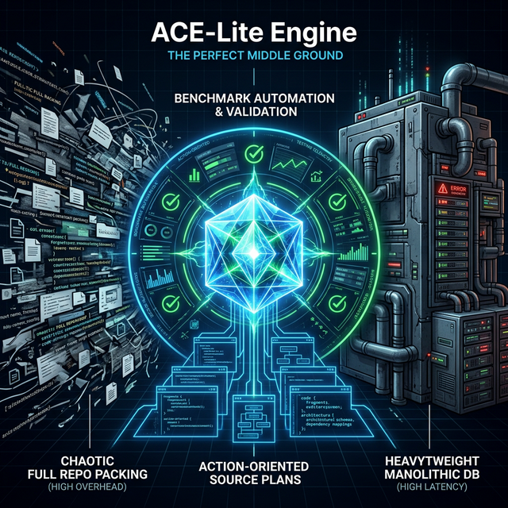

# ACE-Lite Engine

<p align="center">
  
</p>

Local-first, MCP-native Active Context Engine for AI coding.

ACE-Lite ships both a CLI (`ace-lite`) and an MCP server entrypoint (`ace-lite-mcp`) so the same retrieval and planning stack can be used from terminals, CI, and MCP-compatible agent hosts.

ACE-Lite avoids "dump the whole repository into the model" workflows. Instead, it runs a deterministic pipeline to distill structure, retrieve candidates with hybrid rankers, and produce a **source plan** (steps + constraints + selected files/chunks) you can execute and review.

If you want full-repo packing with minimal setup, consider tools like Repomix. ACE-Lite is optimized for **top-k relevant context** with **benchmarkable retrieval quality**.

## Core capabilities

- **Deterministic pipeline**: `memory -> index -> repomap -> augment -> skills -> history_channel -> context_refine -> source_plan -> validation`
- **Hybrid retrieval defaults**: multiple rankers + fusion (lexical / semantic / graph / worktree / feedback), with fail-open behavior
- **Multi-language indexing** (tree-sitter): Python / TypeScript+TSX / JavaScript / Go / Solidity / Rust / Java / C / C++ / C# / Ruby / PHP
- **Skill lazy-loading**: route Markdown skills by query intent, load section-level content only
- **Dual-channel memory**: MCP primary with REST fallback
- **RepoMap generation**: token-budgeted repository map (`json` + `md`)
- **Validation-aware planning**: source plans can carry validation tests, patch artifacts, and evidence checks
- **Workspace planning**: multi-repo routing, workspace summaries, and evidence-gated workspace plans
- **Plugin hooks**: `before/after` stage hooks via in-process and MCP runtime
- **Benchmark automation**: quality scoring, baseline comparison, and regression gates
- **Layered config**: `home -> repo -> cwd -> CLI`

## When to use ACE-Lite

- Use **ACE-Lite** when you want a **plan + curated context** (top-k files/chunks) with deterministic, regression-tested selection.
- Use **repo packers** when you want **full-repo context** quickly and accept lower precision.
- Use **DB-backed vector search** when you need **always-on semantic search at scale** and accept backend complexity.

## Positioning

ACE-Lite is designed for the middle ground between "pack the whole repo into the prompt" and "deploy a heavyweight managed context platform."

| Approach | Common shape | Tradeoff | ACE-Lite position |
| --- | --- | --- | --- |
| Repo packers | Single-file repository export or large prompt stuffing | Fast setup, but token cost and context precision can degrade on larger repos | ACE-Lite retrieves and ranks only the most relevant files/chunks, then emits a source plan |
| Managed context engines | Hosted or platform-oriented code search / semantic retrieval systems | Powerful at scale, but usually heavier to operate or adopt | ACE-Lite stays local-first and file-based, with no required external vector DB |
| Memory layers | Persistent user/project memory across sessions | Good for recall, but memory alone does not produce an execution plan | ACE-Lite includes memory, but centers the workflow on actionable code retrieval and planning |

This is also why ACE-Lite is not trying to be a full IDE or an all-in-one coding agent. Its job is narrower: give any capable model or agent a better, smaller, and more testable working set.

## Why It Stands Out

- **MCP-native**: ACE-Lite exposes its core capabilities through MCP, which makes it usable from modern MCP-compatible clients and agent runtimes.
- **Benchmarkable retrieval**: ACE-Lite treats retrieval quality as something you can measure in CI, not just judge by feel.
- **Local-first**: the default workflow does not require a hosted backend or a separate search cluster.
- **Action-oriented output**: the end product is a source plan with selected files, chunks, and constraints, not just raw retrieved text.

## Competitive Notes

The high-level competitive framing is directionally right, with a few important caveats:

- Repo packing is a real comparison point, but not every local coding tool is "full dump into prompt only." Some tools also maintain repo maps or lightweight retrieval layers.
- Managed products such as Augment Code and Sourcegraph do far more than simple vector search; they combine search, code intelligence, and platform integrations.
- Memory products such as Mem0 address a different layer of the stack. They are complementary more often than they are direct substitutes.

The stronger open-source claim for ACE-Lite is not "it beats every alternative everywhere." The stronger claim is that it offers a rare combination of MCP integration, deterministic retrieval, local-first operation, and built-in regression testing for context quality.

## Installation

```bash
python -m venv .venv
.venv\Scripts\activate
pip install -e .[dev]
```

Requirements:

- Python 3.10+
- For source checkouts, rerun `ace-lite self-update` or `python -m pip install -e .[dev]` after pulling changes so console entrypoints and package metadata stay in sync

## Quickstart

See `docs/README.md` and `docs/guides/GETTING_STARTED.md` for the fastest path.

One-command demo (after install):

```bash
ace-lite demo
```

Top-level CLI areas currently exposed by the codebase:

- `plan`, `plan-quick`, `index`, `repomap`
- `benchmark`, `workspace`, `runtime`, `doctor`
- `memory`, `profile`, `feedback`, `skills`, `self-update`

Build index:

```bash
ace-lite index --root . --output context-map/index.json
```

30-second checks:

```bash
ace-lite doctor
```

Build RepoMap:

```bash
ace-lite repomap build --root . --ranking-profile graph --output-json context-map/repo_map.json --output-md context-map/repo_map.md
```

Run planner:

```bash
ace-lite plan-quick --query "trace how benchmark thresholds are applied" --root . --top-k 8
ace-lite plan --query "trace how benchmark thresholds are applied" --repo ace-lite-engine --root . --skills-dir skills
```

Local profile and memory workflows:

```bash
# Manage local profile facts
ace-lite profile add-fact "Prefer deterministic patches" --confidence 0.9
ace-lite profile show

# Store/search/wipe local memory notes with namespace isolation
ace-lite memory store "Fix auth fallback behavior" --namespace repo:ace-lite --tag kind=bugfix
ace-lite memory search "fix auth" --namespace repo:ace-lite --limit 5
ace-lite memory wipe --namespace repo:ace-lite
```

Service-mode runtime utilities:

```bash
# Inspect resolved runtime settings and cache / MCP health
ace-lite runtime settings show --root .
ace-lite runtime doctor --root .
ace-lite runtime doctor-mcp --root . --probe-endpoints

# Generate or apply Codex MCP registration from current repo settings
ace-lite runtime setup-codex-mcp --root . --skills-dir skills --dry-run

# Watch layered config changes and validate reloads
ace-lite runtime watch-config --root . --max-polls 10 --poll-interval-seconds 1

# Run heartbeat + cron scheduler from `.ace-lite.yml` runtime section
ace-lite runtime run-scheduler --root . --max-ticks 5 --tick-interval-seconds 60 --simulate-clock
```

Workspace planning and validation:

```bash
ace-lite workspace validate --manifest path/to/workspace.yaml
ace-lite workspace summarize --manifest path/to/workspace.yaml
ace-lite workspace plan --manifest path/to/workspace.yaml --query "where is auth token validation implemented"
ace-lite workspace benchmark --manifest path/to/workspace.yaml --cases-json benchmark/workspace/cases/baseline_cases.json
```

Run benchmark with regression gate:

```bash
ace-lite benchmark run --cases benchmark/cases/default.yaml --repo ace-lite-engine --root . --warmup-runs 1 --output artifacts/benchmark/latest --baseline artifacts/benchmark/baseline.json --benchmark-threshold-profile strict --dependency-recall-floor 0.8 --chunk-hit-tolerance 0.02 --chunk-budget-growth-factor 1.15 --validation-test-growth-factor 1.5 --fail-on-regression
ace-lite benchmark run --cases benchmark/cases/default.yaml --repo ace-lite-engine --root . --warmup-runs 1 --no-include-plans --no-include-case-details --output artifacts/benchmark/ci-fast
ace-lite benchmark report --input artifacts/benchmark/latest/results.json
ace-lite benchmark diff --a artifacts/benchmark/latest/results.json --b artifacts/benchmark/baseline.json
ace-lite benchmark tune-report --input artifacts/benchmark/latest/results.json --output artifacts/benchmark/tune-report/latest
```

MCP server entrypoint:

```bash
ace-lite-mcp --transport stdio --root . --skills-dir skills
```

PowerShell helpers:

```powershell
./scripts/run_smoke.ps1
./scripts/run_benchmark.ps1
./scripts/run_benchmark_tabi_v3.ps1
```

## Release validation

Multi-repository matrix run (3+ repos):

```bash
python scripts/run_benchmark_matrix.py --matrix-config benchmark/matrix/repos.yaml --output-dir artifacts/benchmark/matrix/latest --fail-on-thresholds
```

Skill routing validation across supported CLI hosts:

```bash
python scripts/run_skill_validation.py --repo-url https://github.com/blockscout/frontend.git --repo-ref main --repo-name blockscout-frontend --repo-dir artifacts/repos-workdir/skill-validation --skills-dir skills --output-path artifacts/skill-eval/blockscout_skill_validation_matrix.json --index-cache-path artifacts/skill-eval/blockscout-index.json --languages typescript,javascript --apps codex,opencode,claude-code --min-pass-rate 1.0 --fail-on-miss
```

Release freeze bundle:

```bash
python scripts/run_release_freeze_regression.py --matrix-config benchmark/matrix/repos.yaml --output-dir artifacts/release-freeze/latest --fail-on-thresholds
```

## Repository layout

- `src/ace_lite/` runtime engine and CLI
- `tests/` pytest test suite
- `skills/` Markdown skill manifests and sections
- `benchmark/` cases, matrix config, scoring contracts
- `scripts/` smoke/benchmark helper scripts
- `integrations/` MCP and host integration assets
- `plugins/` plugin examples and runtime extensions
- `docs/` architecture and operational docs

## Index filtering (`.aceignore`)

Create a `.aceignore` file at the repository root to exclude low-signal paths from indexing and retrieval.

More examples: `docs/reference/ACEIGNORE_COOKBOOK.md`.

Example for Go repos with generated code:

```gitignore
# Protobuf output
*.pb.go

# Common generated naming
*_generated.go
*_gen.go

# Go mocks
mock_*.go
*_mock.go

# Vendor
vendor/

# Fixtures
testdata/

# Common contract binding locations (abigen output)
pkg/contract/
```

## Documentation

- Start here: `docs/README.md`
- Getting started: `docs/guides/GETTING_STARTED.md`
- Command cheatsheet: `docs/guides/CHEATSHEET.md`
- Plan quick guide: `docs/guides/PLAN_QUICK.md`
- MCP setup: `docs/guides/MCP_SETUP.md`
- Runtime guide: `docs/guides/RUNTIME.md`
- Workspace guide: `docs/guides/WORKSPACE.md`
- Architecture overview: `docs/design/ARCHITECTURE_OVERVIEW.md`
- Maintainer docs: `docs/maintainers/README.md`
- Reference docs: `docs/reference/ACEIGNORE_COOKBOOK.md`
- Upgrade guide: `docs/reference/UPGRADE_GUIDE.md`

## Known limitations

- Language symbol extraction is best-effort for some grammars (especially C/C++); ranking still falls back to path/module/content signals.
- Embeddings are optional, but when enabled you must keep the embedding `model` + `dimension` consistent with your vector store/collection.
- Design and maintainer notes live under `docs/design/` and `docs/maintainers/`.

## Governance

- License: `LICENSE`
- Contributing guide: `CONTRIBUTING.md`
- Code of conduct: `CODE_OF_CONDUCT.md`
- Security policy: `SECURITY.md`
- Changelog: `CHANGELOG.md`

## Support

- Security reports: see `SECURITY.md`
- General issues/feature requests: open a GitHub issue with reproduction details
